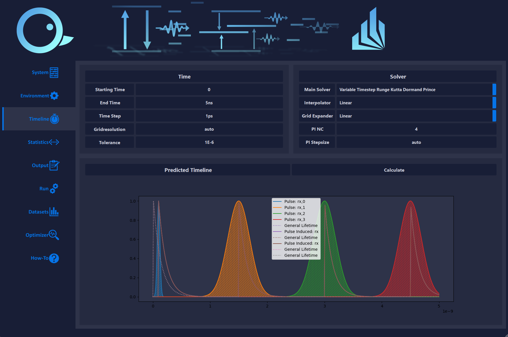

# QDaCC GUI

This repository is part of [QDaCC Tools](https://github.com/davidbauch/QDaCC-Tools) and [QDaCC](https://github.com/davidbauch/QDaCC).

# Comprehensive Feature List

## System Generation

TODO

## Open Quantum Environment Configuration

TODO

## Timeline Configuration and Prediction

TODO

## Comprehensive Output

TODO

## Dataset Generation

TODO

## Parameter Optimization

TODO

#

# Screenshots

Timeline configuration and prediction
